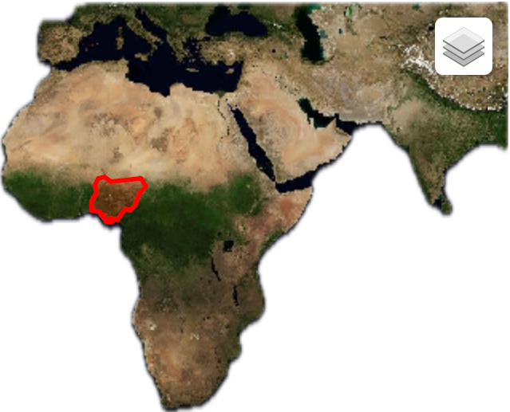

# TAMSAT Rainfall Data Processing (Manual Download)

## Overview
This project processes **manually downloaded** TAMSAT rainfall estimates for Nigeria (1989-2004). Since the **TAMSAT API is no longer available**, users must manually download data from the official TAMSAT portal and process it using the provided Python scripts.

If the API becomes available again, an automated data retrieval option can be added.

---

## 📂 File Structure
```
📁 tamsat_rainfall_project/
│-- 📁 data/                 # Folder for manually downloaded TAMSAT files
│   ├── rainfall_1989.csv    # Example CSV file
│   ├── rainfall_1990.csv
│   ├── ...
│-- 📄 tamsat_manual_processing.py  # Script to process downloaded data
│-- 📄 run_manual_processing.py     # Script to run processing workflow
│-- 📄 tamsat_api.py                # (Optional) API-based script if the API is restored
│-- 📄 run_download_extract.py      # (Optional) API-based processing script if needed
│-- 📄 README.md              # Documentation
│-- 📄 requirements.txt       # Python dependencies
│-- 📁 venv/                  # Virtual environment (optional)
```

---

## 📥 Data Download Instructions
1. **Go to the TAMSAT Data Portal:**  
   🔗 [https://data.tamsat.org.uk/data-download/rainfall/](https://data.tamsat.org.uk/data-download/rainfall/)
2. **Select the region:** Nigeria
3. **Choose the time period:** 1989 - 2004
4. **Select the file format:** CSV (recommended) or NetCDF
5. **Download the data files** and **save them inside the `data/` folder** in your project directory.


## 🛠 Installation
Before running the script, ensure you have Python installed along with the necessary libraries. If not, install them using:
```bash
pip install pandas xarray
```

### **Creating a Virtual Environment (Recommended)**
It is best practice to create a virtual environment for dependency management:
```bash
# Create a virtual environment
python -m venv tamsat_env

# Activate the environment
# On Windows:
tamsat_env\Scripts\activate
# On macOS/Linux:
source tamsat_env/bin/activate

# Install dependencies
pip install pandas xarray
```
If you need additional dependencies, install them inside this environment.

---

## 🚀 Running the Processing Script
Once the data is downloaded, run the following command:
```bash
python run_manual_processing.py
```
This will:
- **Read all downloaded TAMSAT files** from the `data/` folder.
- **Process and merge the data** into a single file.
- **Save the cleaned dataset** as `processed_tamsat_nigeria.csv`.

---

## 🔄 API Option (If Available in the Future)
If TAMSAT reinstates API access, you can modify the script to automate downloads. Keep an eye on:
🔗 [https://research.reading.ac.uk/tamsat/](https://research.reading.ac.uk/tamsat/)

### **API-Based Files (If API is Restored)**
- `tamsat_api.py`: A script that interacts with the API to download data automatically.
- `run_download_extract.py`: A script that manages API-based data extraction.

For now, you must manually download the data.

---

## 📝 Troubleshooting
### **1. "Folder 'data/' does not exist"**
✅ Ensure that you have created the `data/` folder and placed the downloaded files inside.

### **2. "No data files found"**
✅ Double-check that you have downloaded the correct format (**CSV or NetCDF**).

### **3. "File format not recognized"**
✅ If using NetCDF files, modify `run_manual_processing.py` to:
```python
file_format = "netcdf"  # Instead of "csv"
```

### **4. TAMSAT website not loading**
✅ Try a different network or check if the site is down using [https://downforeveryoneorjustme.com](https://downforeveryoneorjustme.com)

---

## 🔧 Modifications
This script is flexible! You can:
- **Filter data by region**
- **Adjust the time range**
- **Merge multiple years into a single dataset**
- **Support alternative data formats**

For additional features, feel free to modify `tamsat_manual_processing.py` accordingly.
